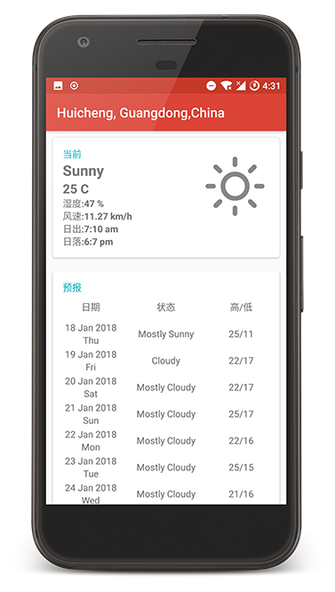
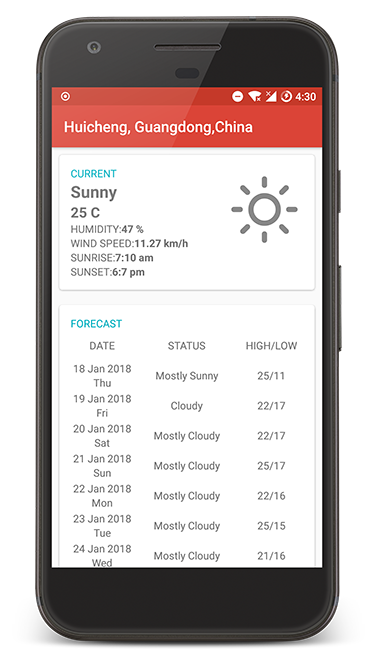

# HO!天气 HO! Weather

HO!天气是一个基于LBSAndroid天气类APP，所使用API来自于**YAHOO!WEATHER API**

HO! Weather is an Android Weather  APP based on LBS, the API comes from **YAHOO!WEATHER API**

## 截图 Screenshot

|          MainPage(Chinese)           |          MainPage(English)           |
| :----------------------------------: | :----------------------------------: |
|  |  |

## 原理 How it works

1.通过腾讯地图定位SDK获得经度和纬度

1.Get longitude and latitude through Tencent map positioning SD

2.将经度和纬度拼接雅虎天气API获得天气的JSON数据

2.Merge the longitude and latitude to Yahoo weather API for the weather JSON data

3.将JSON数据解析并展示到界面上

3.Parse and display JSON data to the interface

## 相关项目Open Source Project

| Project                                  | Introduction                             |
| ---------------------------------------- | ---------------------------------------- |
| [Okhttp](https://github.com/square/okhttp) | An HTTP+HTTP/2 client for Android and Java applications |
| [Gson](https://github.com/google/gson)   | A Java serialization/deserialization library to convert Java Objects into JSON and back |
| [Butterknife](https://github.com/JakeWharton/butterknife) | Bind Android views and callbacks to fields and methods |
| [WeatherIconView](https://github.com/pwittchen/WeatherIconView) | Weather Icon View for Android applications |
| [FlipProgressDialog](https://github.com/Taishi-Y/FlipProgressDialog) | Airbnb like ProgressDialog with Image Flip Animation |
| [Android Support Libraries](https://developer.android.com/topic/libraries/support-library/index.html) | The Android Support Library offers a number of features that are not built into the framework. These libraries offer backward-compatible versions of new features, provide useful UI elements that are not included in the framework, and provide a range of utilities that apps can draw on. |


## 联系我 Contact me 

EMAIL:zhaoweihaochn@gmail.com

WEBSITE:http://zhaoweihao.me

ABOUT ME:http://zhaoweihao.me/about

## 请我喝咖啡 Offer me a cup of coffee

:heart:[Alipay支付宝](http://op4e089f0.bkt.clouddn.com/1512475882201.jpg)

:heart:[Paypal](https://www.paypal.me/zhaoweihao)

## 许可证 License

```
Copyright 2017 Zhao Weihao

Permission is hereby granted, free of charge, to any person obtaining a copy of this software and associated documentation files (the "Software"), to deal in the Software without restriction, including without limitation the rights to use, copy, modify, merge, publish, distribute, sublicense, and/or sell copies of the Software, and to permit persons to whom the Software is furnished to do so, subject to the following conditions:

The above copyright notice and this permission notice shall be included in all copies or substantial portions of the Software.

THE SOFTWARE IS PROVIDED "AS IS", WITHOUT WARRANTY OF ANY KIND, EXPRESS OR IMPLIED, INCLUDING BUT NOT LIMITED TO THE WARRANTIES OF MERCHANTABILITY, FITNESS FOR A PARTICULAR PURPOSE AND NONINFRINGEMENT. IN NO EVENT SHALL THE AUTHORS OR COPYRIGHT HOLDERS BE LIABLE FOR ANY CLAIM, DAMAGES OR OTHER LIABILITY, WHETHER IN AN ACTION OF CONTRACT, TORT OR OTHERWISE, ARISING FROM, OUT OF OR IN CONNECTION WITH THE SOFTWARE OR THE USE OR OTHER DEALINGS IN THE SOFTWARE.
```

